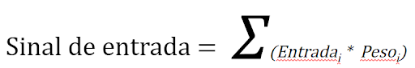
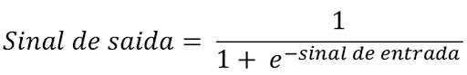
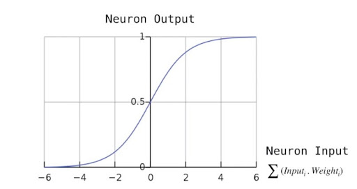
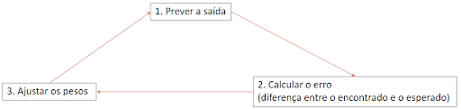
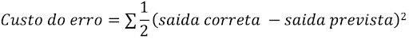

# Machine-Learning

O que as bibliotecas prontas para rodar algoritmos de “machine learning” fazem e como fazem, abordaremos isso neste conteúdo.

“Quando falamos em redes neurais artificiais (RNAs), estamos falando de modelos computacionais inspirados no sistema nervoso central de um animal, que são capazes de aprender e reconhecer padrões, ou seja são capazes de realizar aprendizado de máquina, que do inglês(machine learning)“.

Com o sistema “baseado em rede neural” caso o comportamento dos dados de entrada mude, o programador não precisa reprogramar o sistema, ele mesmo é capaz de se readaptar, isso é IA(inteligência artificial) e para que isso funcione de forma eficiente, o sistema deve ser capaz de perceber quais dados de entrada são relevantes(qual dado tem maior peso).

importante lembrar que a relevância do dado não deve ser dada pelo programador, se isso acontecer teremos um sistema viciado, o que no ramo de estatística e inteligência artificial chamamos de overfitting, se um determinado dado (sinal de entrada) deixar de ser relevante (for depreciado) o próprio sistema deverá ser capaz de identificar e se basear em outro que tiver maior valor, os pesos são dados de forma dinâmica, e o sinal da entrada é usada para calcular o sinal de saída,  logo abaixo temos a fórmula matemática e mais em seguida um gráfico que melhor representa tudo isso. 

## Relevância.

## Função sigmóide.

Logo abaixo está o gráfico da função sigmóide de uma rede neural, ela representa a probabilidade de 0 a 100%, vale lembrar que ela nunca atingirá 100% ou seja ela tende a 100%, os valores na parte inferior representam os pesos de entrada, quanto maior o peso mais a curva tende a 1 ou seja maior a chance de ser a solução para o problema(determinando o grau de confiabilidade).

Para descobrir os pesos é necessário treinar a rede neural, para isso inicia-se com pesos aleatórios e confere se é o resultado esperado, caso não seja, repete-se o processo até que se chegue a ao resultado esperado, funciona exatamente como por exemplo afinar um instrumento musical, “uma corda de violão”. 

## Fórmula para calcular o custo do erro:

 